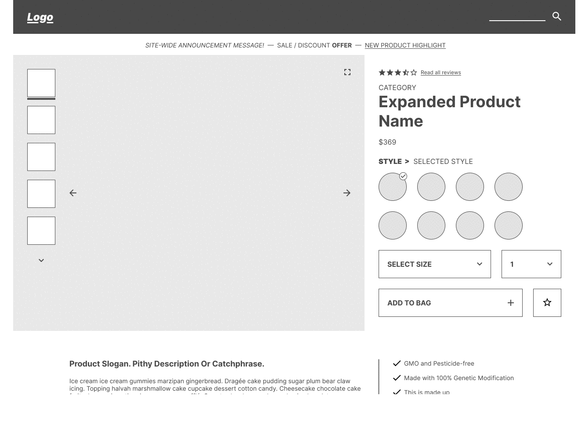

# Project Catwalk

## Overview
This is our HR-RFP54 Front-End capstone project. We're building a product detail page for an e-commerce style website.
We have been provided a business requirement linked [here](https://docs.google.com/document/d/1KAqduzY8ae3DYrSoCL1i23qHe95zJRYFulqMk-sGLWY/edit#).

## Table of Contents

Description
  - Overview: The top-most module on the Product Detail page.  The functionality contained within this module can be divided into several pieces:
    - Image Gallery
    - Product Information
    - Style Selector
    - Add to Cart

  - Related Items & Products: Display two sets of related products:
    - first set - a list of products determined interally related to the product currenetly being viewed
    - second set - a list custom created by user

  - Reviews and Ratings: Allow viewing and submission of reviews for the product selected.  The functionality contained within this module can be divided into several pieces:
    - Write new review
    - Reviews List
    - Sorting
    - rating breakdown
    - product breakdown

## Installation
  - fork and clone this repo
  - run `npm install`
  - run `npm start`

## Usage
It provides a much more detailed page for certain products that a user may have interest in. Smooth user experience can create a much better shopping experience. Leads users to be able to buy the products and add to their shopping carts more efficiently.

### Team Members
- [Zach Bretz](https://github.com/orgs/TeamArtemis54/people/zbretz) : Team Goal Tracker, Overview team
- [Erin O'Connor](https://github.com/orgs/TeamArtemis54/people/oconnorir) : UI/UX owner, Reviews and Ratings Team
- [Jinhoo Bong](https://github.com/orgs/TeamArtemis54/people/JinhooBong) : Team Lead, Related Items & Products team